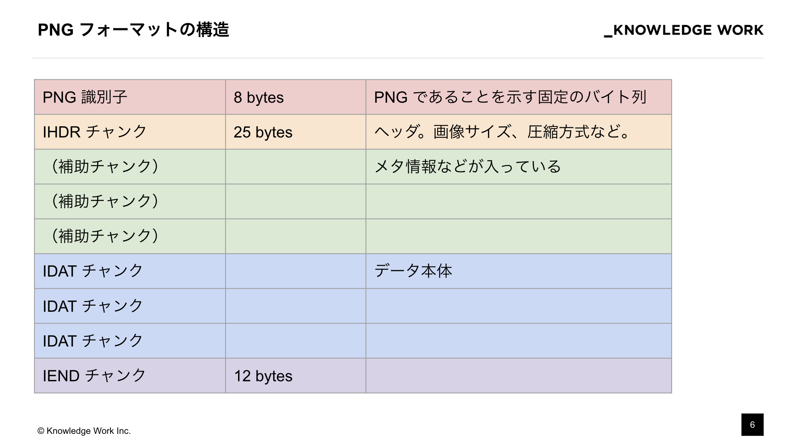
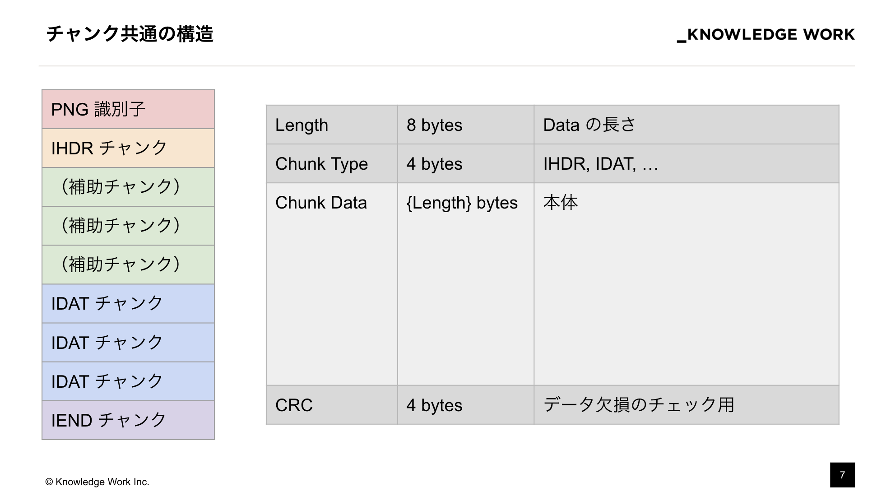
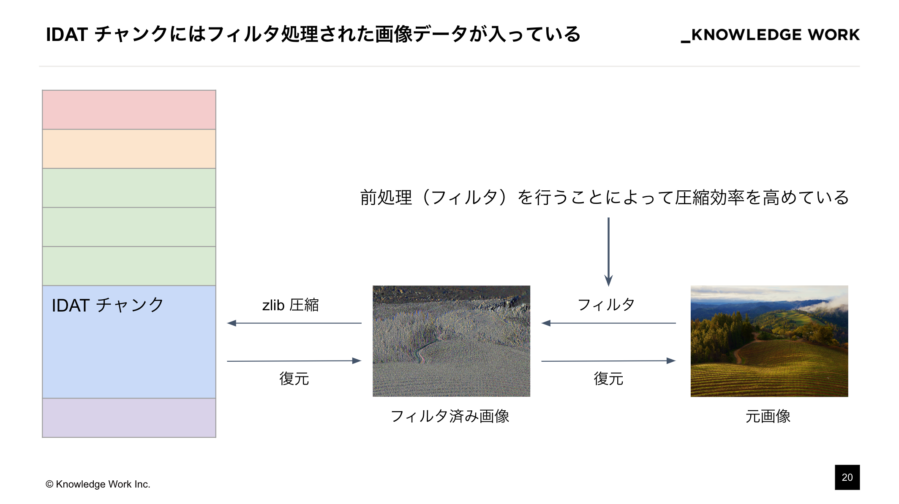
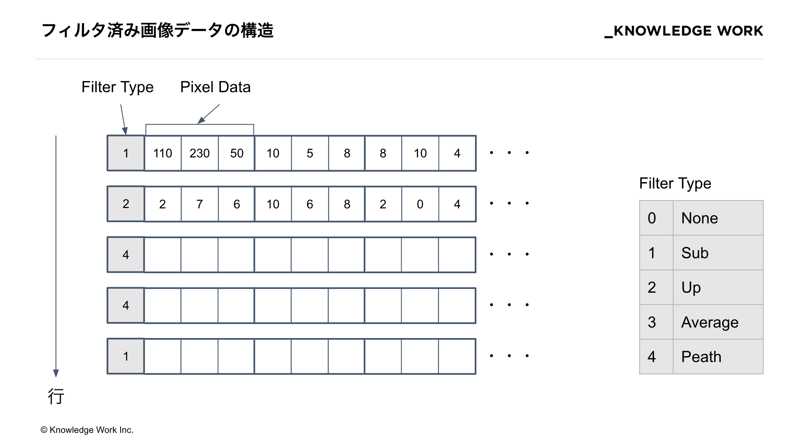
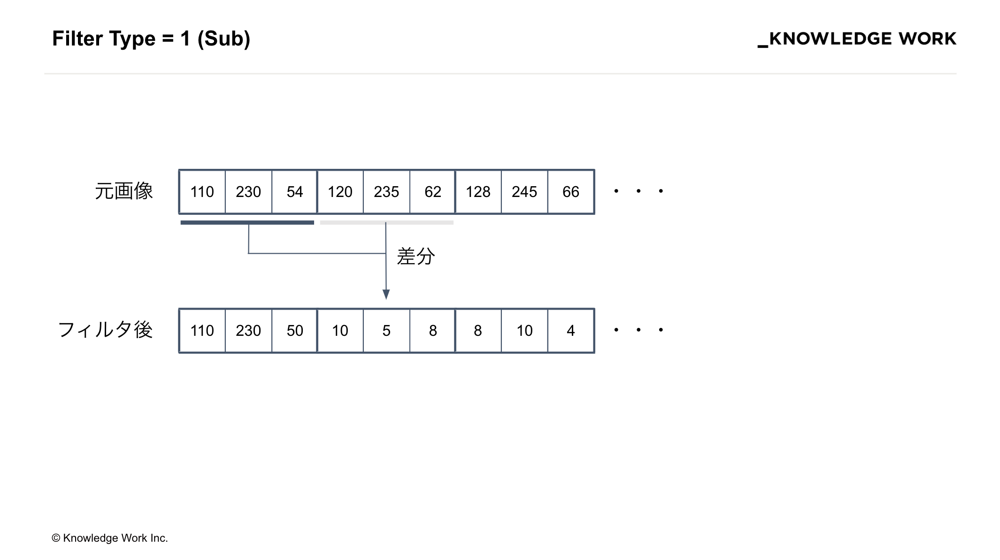
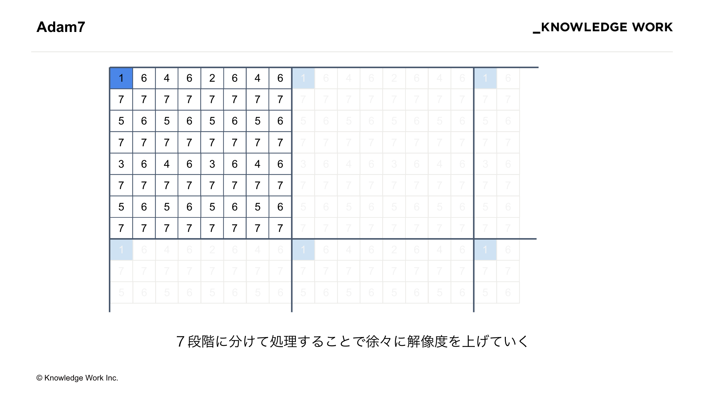
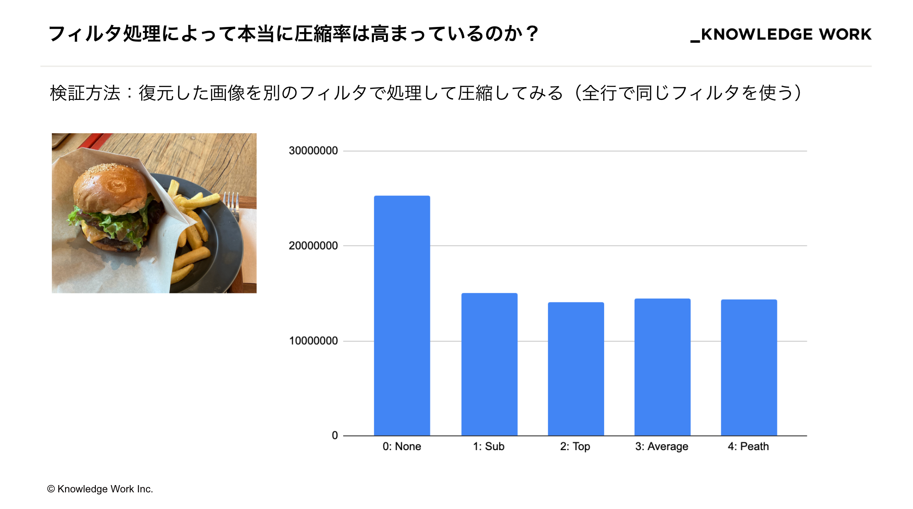
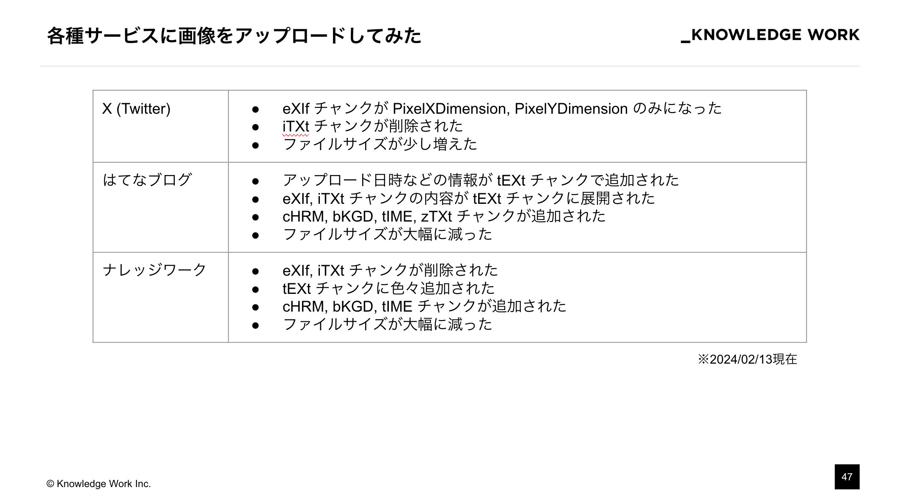

※ 全体的に WIP

こんにちは。ナレッジワークの [torii](https://twitter.com/jinjor) です。
社内の LT 大会で「PNG を読んでみた」という内容の登壇をしたので、その内容をブログでも簡単に紹介したいと思います！

画像ファイルとしてとても身近な PNG ですが、普段はライブラリを使って処理するため自前でバイナリを読んだり仕様を追ったりする機会も少ないのではないでしょうか。
中身を理解することで、Web サービスにおいてより安全かつ最適な方法で画像ファイルを扱うのに役立てよう、というのがこの記事の狙いです。

# 経緯（社内勉強会の取り組みについて）

ナレッジワークでは以前より Encraft という社外向けの勉強会を定期的に開催していますが、社内向けにも Encraft Share Day という勉強会があります。
Encraft Share Day は、より多くのメンバーに発表の場を提供することで技術発信の経験を積んでもらう目的で開催されています。

そして今回は発表者の１人として私 torii に白羽の矢が立ったので必死でネタを考えた結果、PNG の仕様を勉強して発表することになりました。
いわゆる勉強会駆動勉強というやつですね。

# 発表内容

前置きが長くなりましたが、ここからは簡単に発表した内容をこの記事でも説明します。
（この発表では PNG の技術の概要を示してはいますが、実際にパースするのに必要な情報を完全には網羅していないため詳細は他の記事も参照していただければと思います。）

TODO: SpeakerDeck

## お題

iPhone で撮影したハンバーガーの写真です。
これを自前の実装でパースして中身を読んでみました。

## PNG フォーマットの構造

PNG バイナリは、先頭に PNG であることを示す８バイトの識別子があり、その後はチャンクと呼ばれるデータのまとまりが最後まで連なる構造になっています。
各チャンクは、長さ・種別・データ・CRC という共通の構造から成り、チャンクの種別によってデータの内容が変わります。

チャンクの中でまず重要なのが IHDR （画像ヘッダ）と呼ばれるチャンクです。
IHDR チャンクは設置が必須であり、画像のサイズやカラータイプ、インターレースの有無といった主要な情報が格納されています。
カラータイプが 3 (インデックス画像)の場合は PLTE チャンクの設置も必須になっています。

IHDR チャンクの後には、補助チャンクと呼ばれる設置が任意のチャンクがいくつか連なります。
種類が沢山あるので一例を挙げると、 tEXt チャンクは Key-Value の形式で画像のタイトルや更新日時といったメタデータを埋め込めるようになっています。

次にメインとなる IDAT チャンクです。ここに画像の本体となるピクセルデータが格納されています（詳細は後述）。

そして最後に、データの終端を示す IEND チャンクがあります。

## ヘッダ・メタデータを読んでみた

ここまでの情報で、ヘッダ・メタデータが読めるようになったので早速読んでみました。

以下では、実際に画像データに入っていたヘッダ（IHDR）およびメタデータ（補助チャンク）を紹介します。

### IHDR

ヘッダ情報として、次のようなデータが格納されていました。

- 画像のサイズ: 2620px x 1850px
- ビット深度: 8（各色 256 段階）
- インターレース: なし

### iCCP

iCCP チャンクに格納されている情報は ICC プロファイルと呼ばれ、異なるデバイス間で色を正確に再現するために利用されるようです。
（この部分のパースはライブラリを使用しました）

- colorSpace: RGB
- connectionSpace: XYZ

### eXIf

eXIf チャンクは、カメラの種類や撮影場所、撮影日時などを記録しておくための領域です。
Exif 自体は JPEG でも使われている仕様で、読み方は別途そちらのドキュメントを参照する必要があります。

お題の画像を解析した結果、かなり色々な情報が詰め込まれていることがわかりました。

- カメラ: iPhone SE (3rd generation)
- 撮影日時: 2024/02/06 12:28:52
- 撮影場所: 北緯 35.664 度, 東経 139.745 度

火曜のお昼にオフィスの近くでハンバーガーを食べていたのがバレバレですね（苦笑）
多くの Web サービスではプライバシーを考慮して、画像アップロード時にこのチャンクを削除するなどの対策をしているようです。

### pHYs

物理的な寸法が格納されています。

- 単位あたりのピクセル数（X 方向）: 2835
- 単位あたりのピクセル数（Y 方向）: 2835
- 単位: メートル

### iTXt

iTXt チャンクは、 tEXt チャンクの国際化（international）版です。
本来は tEXt チャンク同様に Key-Value 形式で保存するものですが、ここでは Adobe XMP という形式の XML が入っており、 eXIf とも重複するメタデータが一式入っていました。

- keyword: XML:com.adobe.xmp
- text: `<x:xmpmeta xmlns:x="adobe:ns:meta/" x:xmptk="XMP Core 6.0.0">\n ...`

## IDAT チャンクの構造

ここからはいよいよ画像データの本体（ピクセルデータ）を読むために仕様をさらっていきます。

IDAT チャンクには zlib 圧縮された画像データが入っています。
ただし、この zlib 圧縮されている画像データは圧縮効率を高めるために事前にフィルタ処理を加えたものになります。
したがって、元の画像を取り出すには、解凍したデータに逆のフィルタをかけて復元する必要があります。

フィルタ済み画像は、各行の先頭にフィルタ種別が付与された構造になっています。
つまり、行ごとに「この行はこの種類のフィルタ処理がされていますよ」ということが示されています。

フィルタ種別は、以下のように 5 種類が定義されています。

| type | 名前    | 計算方法                                                                             |
| :--- | :------ | :----------------------------------------------------------------------------------- |
| 0    | None    | フィルタなし                                                                         |
| 1    | Sub     | 左隣のピクセル値との差分を取る                                                       |
| 2    | Top     | 上隣のピクセル値との差分を取る                                                       |
| 3    | Average | 左隣と上隣のピクセル値の平均との差分を取る                                           |
| 4    | Peath   | Peath アルゴリズムによって左・上・左上の中から選択されたのピクセルの値との差分を取る |

具体例として、フィルタ種別１（Sub）の場合「左隣のピクセル値との差分を取る」操作をその行の全てのピクセルについて行います。

（補足：値はバイトの範囲に収まるように 256 の剰余を計算します）

逆にフィルタ処理された画像を元に戻すには、左から順番に加算していきます。

## 画像を自前でパースして描画してみた様子

以上の知識でいよいよ画像データ本体が読めるようになったので、デモ用のページに描画してみました。

左上の画像が `` 要素で普通に描画した見本画像で、右が自前でパースしたものを `<canvas>` 要素に 1px ずつ描画したものです。
見ての通り、同じ画像が描画できています。

しかし、初期バージョンでは画像の「フェッチ -> パース -> 描画」を全て直列で実行していたため、描画されるまでに空白の状態で待たなければなりませんでした。
そこで、「フェッチ -> パース -> 描画」を全て並行にストリーミングで処理できるバージョンを実装しました。結果、画像が読み込んだ部分から（上から）順に描画されるようになり、先ほどよりも少し体験が改善しました。

ここまでで、お題の画像を無事読み込めたことで仕様を正しく理解できたことが確認できました。
ここからは、実装の過程で気になったことを検証していきます。

## 検証１：インターレースで体験がよくなるか

PNG 画像はインターレース方式でエンコードすることもできます。
インターレース方式では、ピクセルの順番を並び替えて転送することで、低解像度ではあるが全体が認識できる画像を優先的に表示できます。

PNG のインターレースでは Adam7 というアルゴリズムが使われます。
Adam7 では、以下のようにピクセル全体を 8x8 の領域に分割し 1〜7 の番号を振ります。

そして、１のみを集めて作った画像、2 のみを集めて作った画像、...、の順番に画像を並べます。
こうすることで、読み込み時に低解像度の画像をまず描画し、徐々に解像度を上げながら表示することが可能になります。
（そのままだとピクセルが飛び飛びなので、まだ読み込まれていない部分は読み込み済みのピクセルで補完する必要があります）

先ほどの画像をインターレースありの画像に変換して描画すると次のように表示されました。
読み込みを開始してすぐに全体が把握できるようになっています（画像のサイズにもよりますが、今回の画像では粗さは気になりませんでした。）

## 検証２：フィルタの効果

「事前にフィルタ処理をかけることで本当に圧縮率が高まっているのか」も気になったので、調べてみました。
検証方法としては、元の画像を復元した後、再び type 1 から 4 のフィルタをかけて圧縮し直してサイズを比較しています（全行で同じフィルタをかけています）

結果は図の通り、何らかのフィルタをかけた方が圧縮後のサイズが小さくなるということがわかりました。
他の画像でも結果は似たり寄ったりでしたが、唯一、コンソール画面のスクリーンショットだけはフィルタをかけた方が逆に圧縮後のサイズが大きくなってしまいました。原因は追っていませんが、ほとんどが黒のベタ塗りという画像の特性によるものと推察されます。この辺は深掘りしていくと面白そうですね。

## 検証３：サービスはユーザーがアップロードした画像をどう扱うか

上の方で述べた通り、 eXIf チャンクや iTXt チャンクにはユーザーのプライバシーに関わる情報が多数格納されていました。
そこで、著名なサービスをいくつかピックアップしてアップロードした画像のメタデータがどのように変わっているかを調べてみました。

今回調査した全てサービスで、プライバシーに関わるメタデータは削除されていることがわかりました。
弊社サービスでも削除されていることが確認できたので安心しました。
細かいところではサービスによって処理内容が違っているのが面白いですね。

# ふりかえり

PNG というテーマを決めた時はほとんど知識のない状態だったので、発表するに値する内容になるかヒヤヒヤしていましたが、蓋を開けたら制限時間の 10 分を軽くオーバーする内容になって（ごめんなさい）よかったです。社内からも面白かった・わかりやすかったという声が多数あって嬉しいです！

次は他の画像ファイルや動画ファイル、PDF なども読んでみたいですね（でもコミットはしません！笑）
